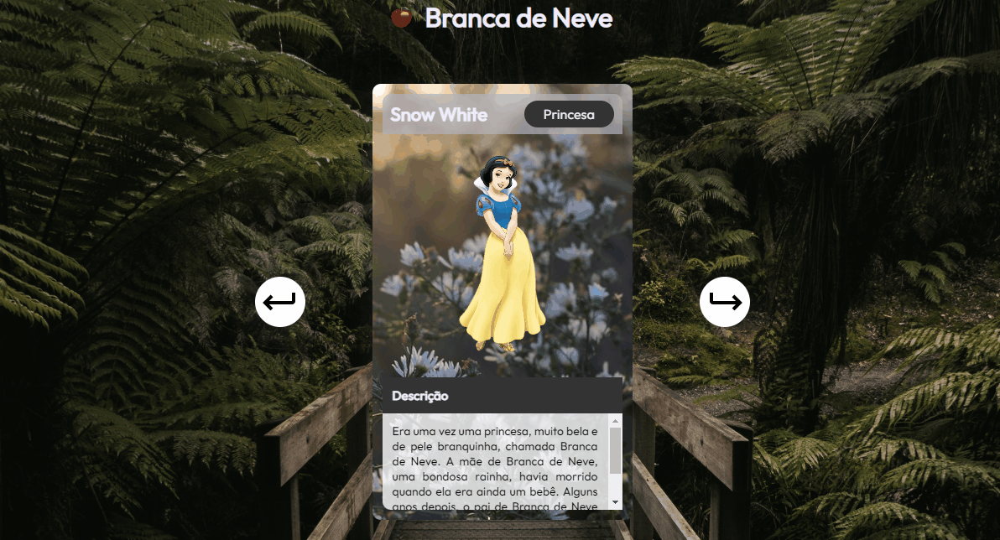

# Projeto Snow Slider  

Projeto realizado durante o evento da MapaDev Week com os mentores do Dev em Dobro. O objetivo foi a criação de um slider de cards, contendo suas descrições e que também fosse responsivo.  

[]

## Meu processo

### Tecnologias utilizadas

- HTML
- CSS
- JS

